# DirectX 12 Renderer / Engine

DirectX 12 기반의 Renderer / Engine 프로젝트입니다.  
렌더링 기능 구현과 **RenderGraph, Multi-threaded Command Recording, FrameResource, UploadAllocator, Descriptor / GPU Resource Lifetime 관리**까지 엔진 내부 구조를 직접 구성했습니다.

---

## Highlights

### Rendering
- Forward / Deferred Rendering
- MRT / GBuffer
- PBR + IBL
- Normal Mapping / TBN
- Shadow Mapping
- Terrain / Distance-based Tessellation
- FBX Loading / Skeletal Animation
- Compute Shader Skinning

### Engine / Optimization
- Scene / GameObject / Component
- RenderGraph
- Multi-threaded Command Recording
- FrameResource
- UploadAllocator
- DescriptorAllocator
- Deferred Release Queue
- Frustum Culling
- Instancing
- GPU Timestamp Profiler
- ImGui Diagnostics

---

# Rendering Features

## Deferred Rendering / GBuffer

Geometry Pass에서 GBuffer를 생성하고 Lighting Pass에서 조명을 계산합니다.

- Position
- Normal
- Albedo
- MaterialInfo

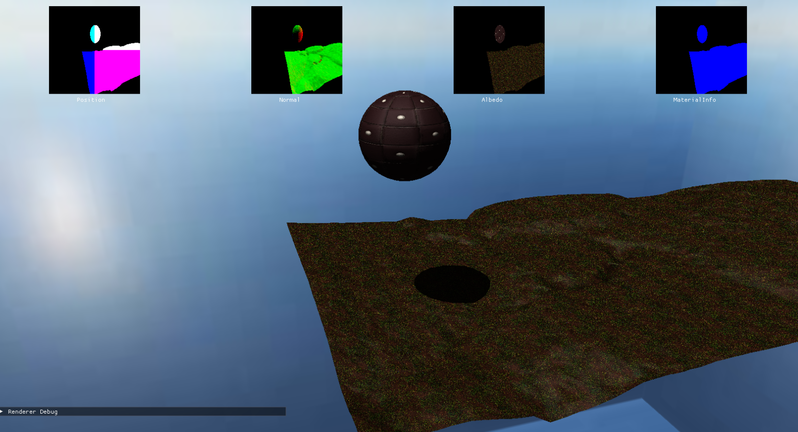

---

## PBR + IBL

Metallic / Roughness 변화와 Environment Map 기반 반사를 확인하기 위한 테스트 Scene입니다.

<table>
<tr>
<td width="50%">

**Metallic / Roughness**

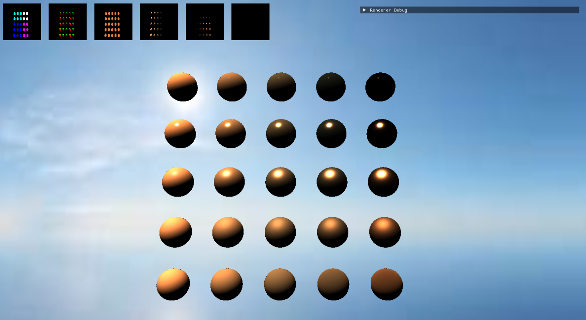

</td>
<td width="50%">

**IBL Reflection**

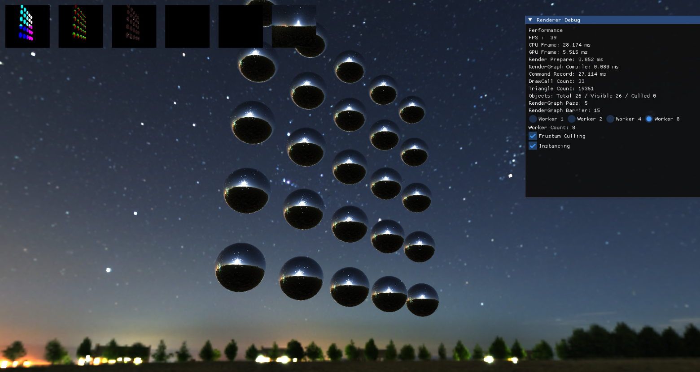

</td>
</tr>
</table>

---

## Normal Mapping / TBN

Tangent-space Normal Map을 TBN 행렬로 변환해 Geometry를 추가하지 않고 표면 조명 디테일을 표현합니다.

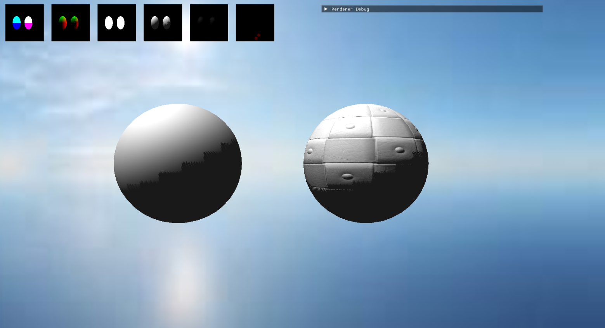

---

## Terrain Tessellation

카메라와 Terrain Patch의 거리에 따라 Tessellation Level을 조절합니다.

<table>
<tr>
<td width="50%">

**Near**

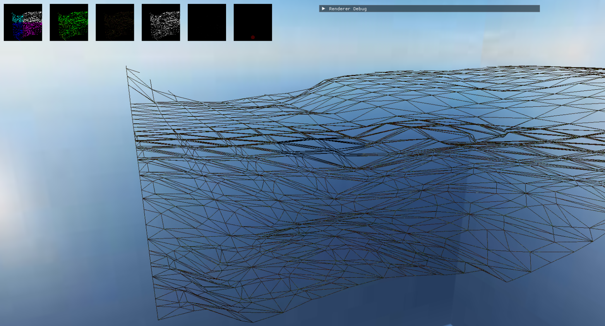

</td>
<td width="50%">

**Far**

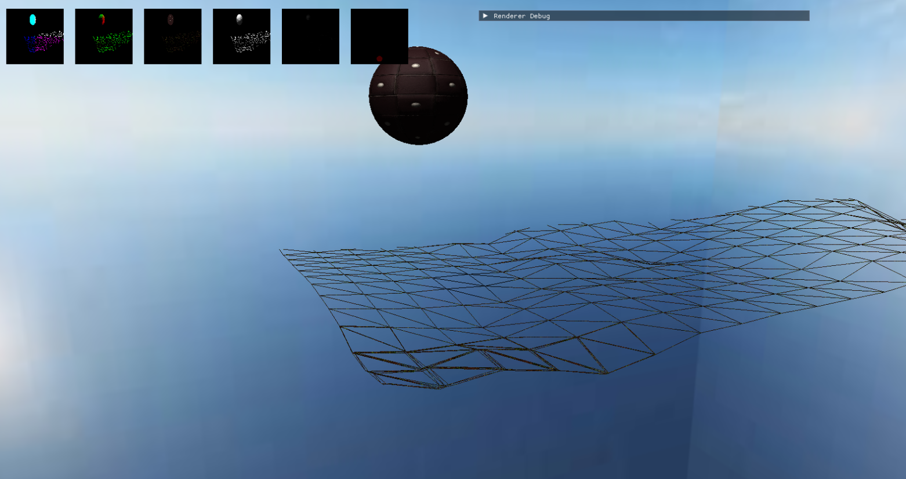

</td>
</tr>
</table>

---

# Performance Benchmark

## Instancing

동일 Mesh / Material 객체를 Instance 단위로 묶어 Draw Call과 CPU Recording 비용을 줄였습니다.

| Metric | OFF | ON |
|---|---:|---:|
| FPS | 3 | 90 |
| CPU Frame | 300.371 ms | 12.054 ms |
| GPU Frame | 3.344 ms | 0.328 ms |
| Command Record | 332.080 ms | 10.102 ms |
| Draw Calls | 410 | 11 |
| Triangles | 309,230 | 309,230 |

<table>
<tr>
<td width="50%">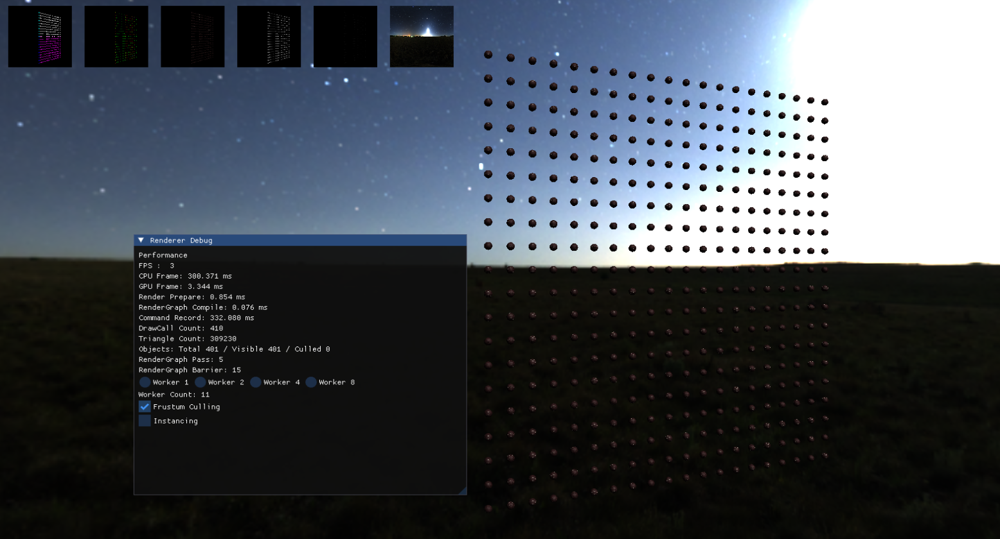</td>
<td width="50%">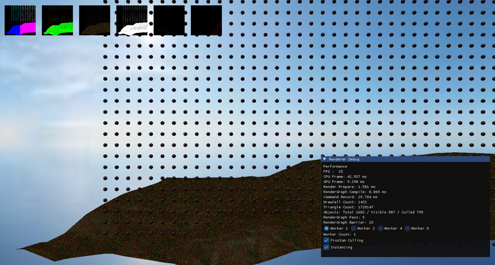</td>
</tr>
</table>

---

## Frustum Culling

View Frustum 외부 객체를 제거해 동일 Scene에서 처리 Object / Triangle 수를 감소시켰습니다.

| Metric | OFF | ON |
|---|---:|---:|
| Visible Objects | 401 | 269 |
| Culled Objects | 0 | 132 |
| Triangles | 309,230 | 207,194 |
| Draw Calls | 11 | 11 |

<table>
<tr>
<td width="50%">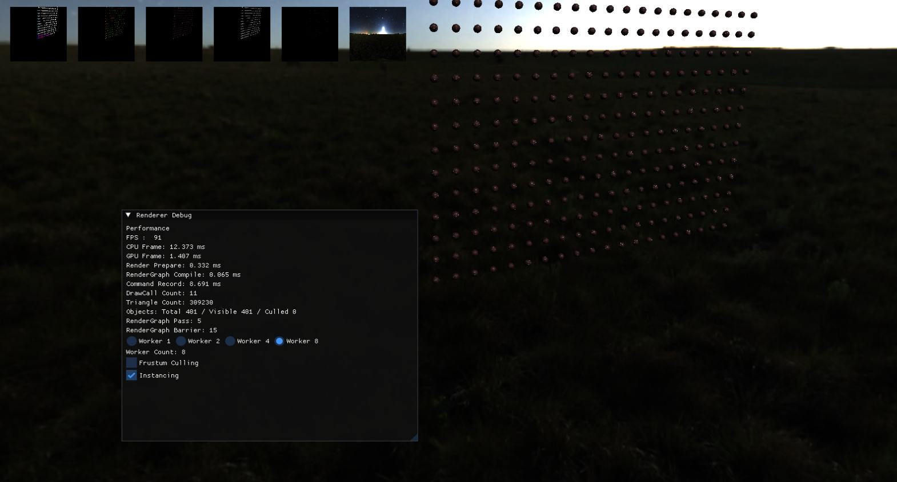</td>
<td width="50%">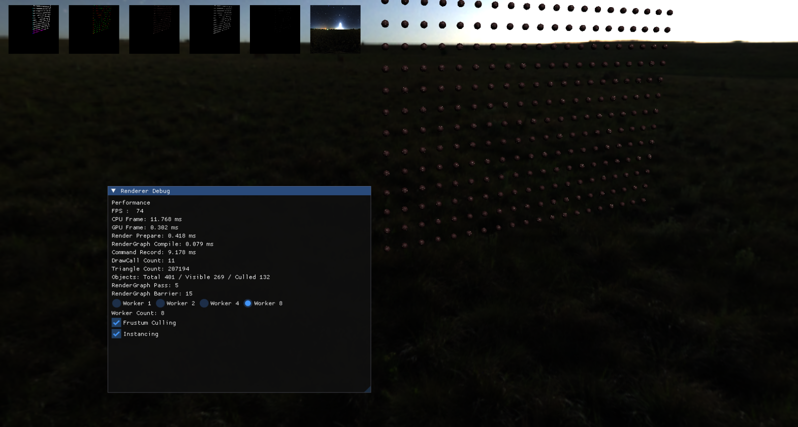</td>
</tr>
</table>

---

## Multi-threaded Command Recording

RenderGraph Pass를 Worker Thread에 분배하고 각 Pass를 독립적인 CommandContext에서 기록합니다.

| Worker Count | Command Record |
|---:|---:|
| 1 | 348.191 ms |
| 2 | 317.171 ms |
| 4 | **207.397 ms** |
| 8 | 280.187 ms |

현재 Scene에서는 Worker 4에서 가장 낮은 Recording Time을 기록했고, Worker 8에서는 Thread / Synchronization Overhead로 성능이 다시 감소했습니다.

<details>
<summary>Worker 1 / 2 / 4 / 8 screenshots</summary>
<table>
<tr>
<td width="50%">Worker 1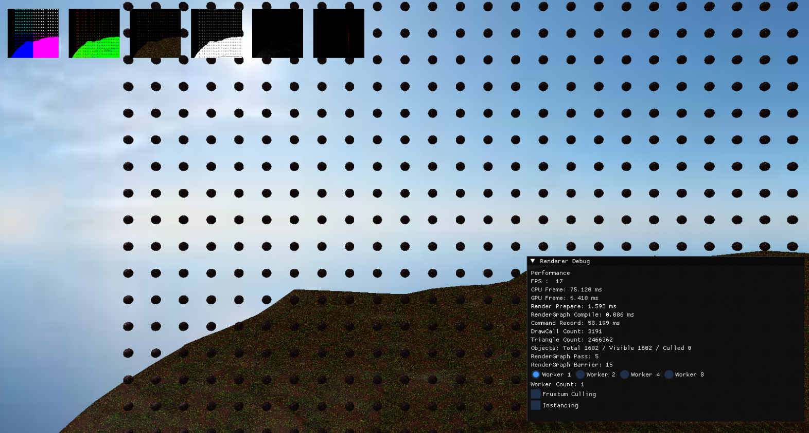</td>
<td width="50%">Worker 2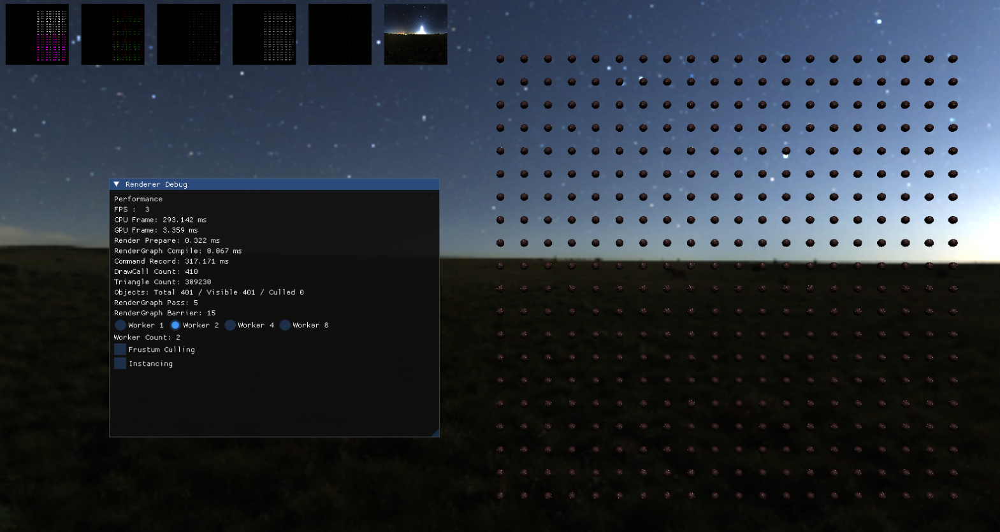</td>
</tr>
<tr>
<td width="50%">Worker 4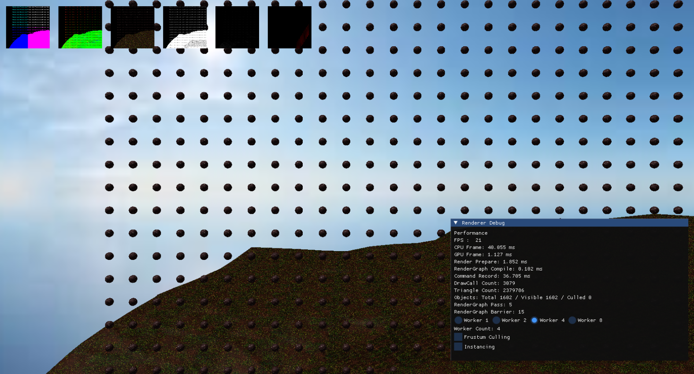</td>
<td width="50%">Worker 8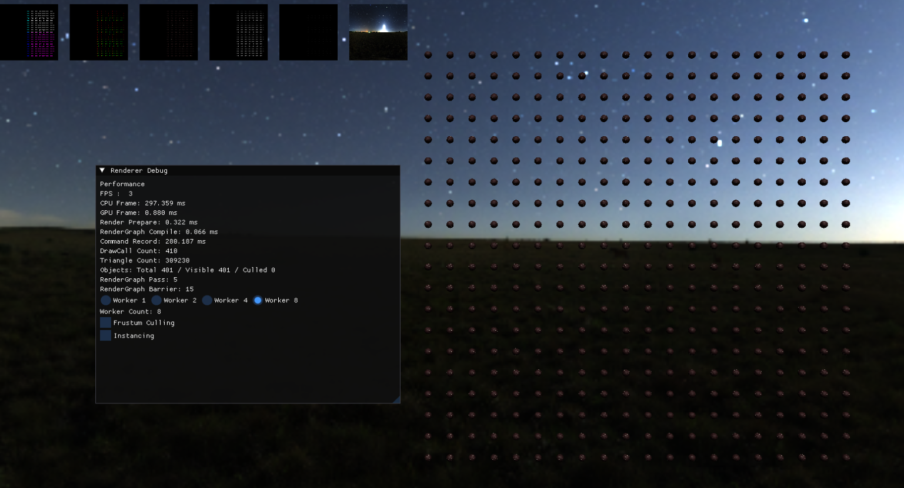</td>
</tr>
</table>
</details>

---

# Engine Architecture

## RenderGraph

Pass가 Resource의 Read / Write / Usage를 선언하면 Dependency와 실행 순서를 계산하고 필요한 D3D12 Resource Barrier를 자동 생성합니다.

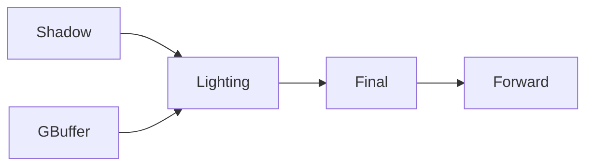

```text
Read / Write 선언
→ Dependency 분석
→ Topological Sort
→ Resource State 계산
→ Barrier 생성
→ Execute
```

## Resource / Frame Management

- **FrameResource**  
  CommandAllocator, UploadAllocator, CommandContext Pool, Fence Value를 프레임 단위로 관리합니다.

- **UploadAllocator**  
  프레임별 큰 Upload Buffer를 Persistent Mapping하고 Linear Allocation 방식으로 동적 데이터를 할당합니다.

- **DescriptorAllocator**  
  Descriptor Slot Allocate / Free와 Free Range Merge를 관리합니다.

- **Deferred Release**  
  GPU가 Resource를 더 이상 참조하지 않는 Fence 완료 시점 이후 Resource / Descriptor를 반환합니다.

---

# Diagnostics

ImGui 기반 Diagnostics UI에서 다음 항목을 런타임에 확인할 수 있습니다.

- FPS / CPU Frame / GPU Frame
- Render Prepare
- RenderGraph Compile
- Command Record
- Draw Calls / Triangle Count
- Visible / Culled Objects
- RenderGraph Pass / Barrier Count
- Worker Count
- Frustum Culling / Instancing Toggle
- RenderTarget Debug View

---

# Final Showcase

최종 Scene에서는 다음 요소를 함께 확인할 수 있습니다.

- Terrain
- Animated FBX Character
- Compute Skinning
- Directional Light
- Dynamic Shadow
- Skybox

**Showcase 핵심:**  
Skinned Animation 결과를 Shadow Pass에도 동일하게 반영하여 Terrain 위 Dynamic Shadow가 애니메이션과 함께 갱신됩니다.

---

# Tech Stack

- C++ / DirectX 12
- HLSL
- FBX SDK
- ImGui
- Visual Studio

---
